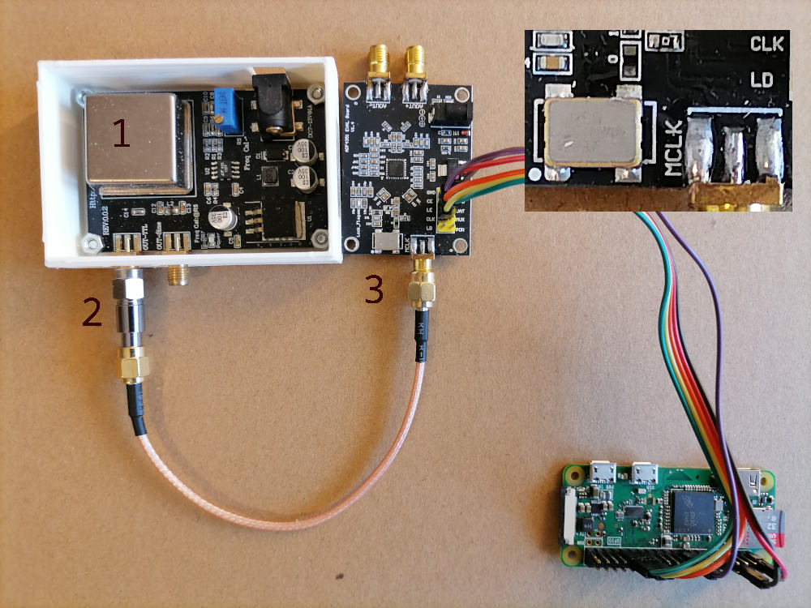

# beacon-23cm

Ham 23 cm CW beacon

This is an amateur radio beacon Proof Of Concept using: 

* 10 MHZ OCXO CTI OSC5A2B02 for stable clock 
* ADF4351 PLL board for generating 1.3 GHz signal
* Arduino / Raspberry board for frequency setting and keying

## What is also needed

* 10 dB attenuator
* couple of SMA pigtails and wires
* 7-13 V and 5 V power supply

## Hardware initial configuration

* adjust OCXO output frequency to get precise 10 MHz by adjusting the trim pot
* move 0 &Omega; resistor near internal 25 MHz generator to MCLK signal path

## Wiring

`OCXO [OUT-TTL] => 10 dB attenuator => ADF4351 [MCLK]`

Connect boards as shown:

```
+---------|-------------------------+
| ADF4351 | Raspberry Pi header pin |
|---------|-------------------------|
| 3V3     | 1                       |
| CE      | 17                      |
| LE      | 27                      |
| CLK     | 29                      |
| DAT     | 31                      |
| GND     | 6                       |
+---------|-------------------------+

```

Example setup looks like this:



1) OCXO
2) 10 dB attenuator
3) ADF4351 with modified resistor

## Software

Software uses modified software from https://github.com/davecrump/RPiADF4351

Source with compiled binary is attached in RPiADF4351

Modification is about:

* changing `clkin` in `ctladf4351.c` from 25 MHz to 10 MHz
* additional argument to mute the output

Keying is done using `morse` from `bsdgames` package piped to `modulate.sh` that controls ADF4351.

In future keying should be done by controlling `POF` pin that keys RF out directly.

## Running

Just run `./beacon.sh`. If PLL of ADF4351 is locked, the LED on the ADF4351 board goes on.
Noting else can be seen, neither read from the ADF4351. Observe RF output.

## What frequency stability to expect

As OSC5A2B02 is specified to be 100 ppb per year and 10 ppb for whole temperature range.
Total expected long-term drift during one year can be as much as 130 Hz so it is a good idea to monitor frequency for the first two years.
If the outside temperature may vary the total frequency drift can be expected as 13 Hz.
For stable temperature the total day-to-day drift come from voltage changes and short term ageing and can be expected about a hertz.

## Feature improvements

* As Linux is not an RTOS and can not guarantee precise keying it is risky to use software generated keying.
Fortunately, DMA can be used using `pigpio` Python library 
* Add a few seconds carrier at the end of each transmission to allow listeners read S-meter, make measurements, etc.
* Remove `SK` at the end what `morse` produces

